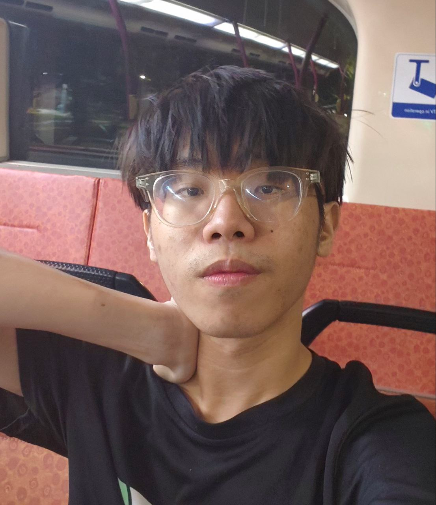
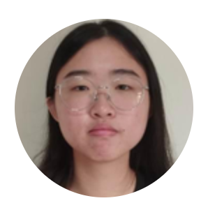
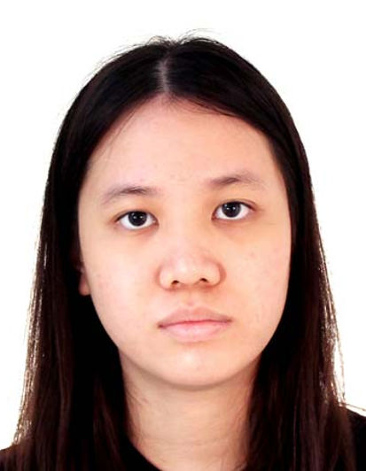

We are a team based in the [School of Computing, National University of Singapore](https://www.comp.nus.edu.sg).

You can reach us at the email `seer[at]comp.nus.edu.sg`

## Project team

### Alroy Loh

[[github](https://github.com/dumboiroy)]
[[portfolio](team/dumboiroy.md)]

- Role: Developer

### Kosolpattanadurong Thitiwat

[[github](http://github.com/catisnotsodium)]
[[portfolio](team/catisnotsodium)]

- Role: Team Lead
- Responsibilities: UI

### Lim Song Lin

[[github](http://github.com/forestmu)] [[portfolio](team/forestmu.md)]

- Role: Developer
- Responsibilities: Data

### Wong Yu Zhen

[[github](http://github.com/wongyuzhen)]
[[portfolio](team/wongyuzhen.md)]

- Role: Developer
- Responsibilities: Dev Ops + Threading

### Lee Zhao Rui

[[github](http://github.com/oilyfishball)]
[[portfolio](team/oilyfishball.md)]

- Role: Developer
- Responsibilities: UI
